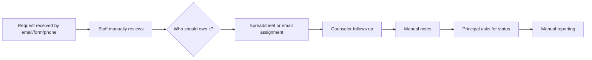
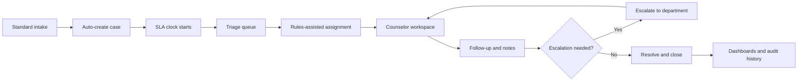
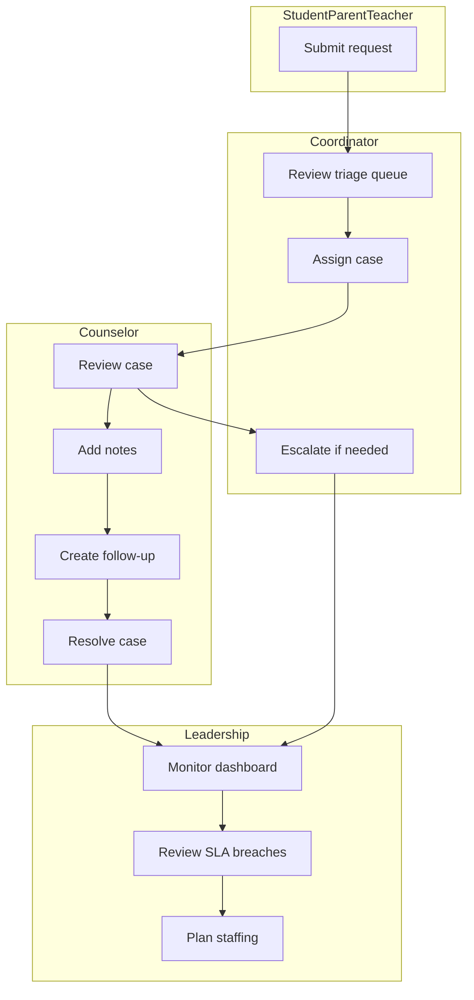
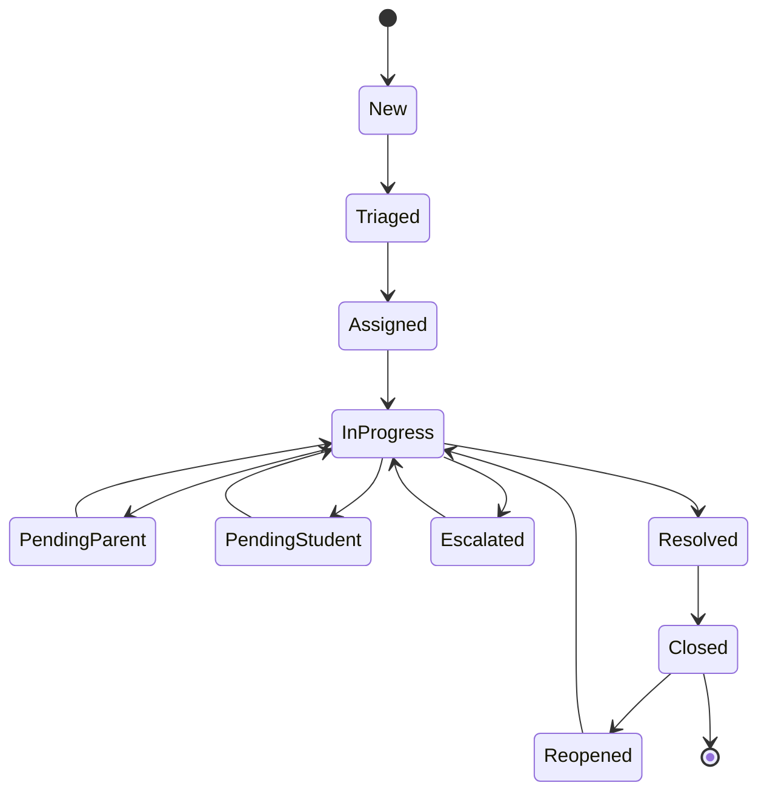

# Business Process Analysis

## AS-IS process

## TO-BE process

## Gap analysis

| Area | Current gap | Future capability | Benefit |
|---|---|---|---|
| Intake | Multiple unstructured channels | Standardized intake form and channel capture | Better classification and reporting |
| Assignment | Manual owner selection | Workload-informed assignment | Lower overload and faster ownership |
| SLA | Not consistently tracked | SLA rules by priority and category | Better accountability |
| Follow-up | Calendar/email reminders | System follow-up tasks | Fewer missed actions |
| Reporting | Manual consolidation | Automated dashboards | Faster executive reporting |
| Audit | Incomplete change history | Case status and field audit log | Stronger governance |

## Swimlane overview

## State model

## Optimization opportunities

- Use SLA urgency to sort triage work.
- Use counselor active workload to guide assignment decisions.
- Standardize escalation reasons and target departments.
- Trigger follow-up reminders before due dates.
- Automate monthly school performance reports.
- Create exception reports for missing assignments, missing closure reasons, and aged cases.
