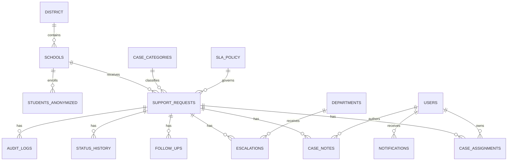
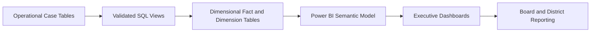

# Data Architecture

## Operational model overview

SafePulse uses a normalized operational schema to support case management and a dimensional analytics layer to support dashboarding and trend analysis.

## Core entities

| Domain | Tables |
|---|---|
| District structure | district, schools, departments, academic_terms, holiday_calendar |
| People and access | users, roles, permissions, user_roles, counselors, students_anonymized |
| Case operations | support_requests, case_assignments, case_notes, follow_ups, escalations, interventions |
| Workflow history | status_history, audit_logs, notifications |
| SLA and reference data | sla_policy, case_categories, priority_reference, status_reference |

## ER diagram

## Normalization approach

- Student identity is anonymized and separated from operational case records.
- Category, status, priority, and department values are reference-managed.
- Case assignment history is separated from current support request status.
- Notes, follow-ups, escalations, and status history are event-style child tables.
- Audit logs capture field-level changes for governance and investigation.

## Dimensional model

### Fact tables

| Fact | Grain | Measures |
|---|---|---|
| fact_case | One row per support request | response hours, resolution hours, SLA flags, reopened flag |
| fact_case_status_event | One row per status change | status duration, transition count |
| fact_counselor_workload | Counselor-school-term-month | active cases, weighted workload, utilization |
| fact_notification | One row per notification | sent count, read count, response lag |

### Dimension tables

| Dimension | Attributes |
|---|---|
| dim_school | school, region, level, district |
| dim_category | category, category group, active flag |
| dim_priority | priority, SLA tier, weight |
| dim_date | date, week, month, quarter, academic term |
| dim_user | role, department, school access |
| dim_status | lifecycle stage, terminal flag |

## Indexing strategy

| Table | Index | Purpose |
|---|---|---|
| support_requests | school_id, submitted_at | school trend and date filtering |
| support_requests | current_status, priority | queue and backlog filtering |
| case_assignments | request_id, assigned_user_id | ownership and workload joins |
| status_history | request_id, changed_at | lifecycle analytics |
| follow_ups | due_at, completed_at | overdue follow-up reporting |
| audit_logs | entity_type, entity_id, changed_at | audit lookup |

## Lineage

